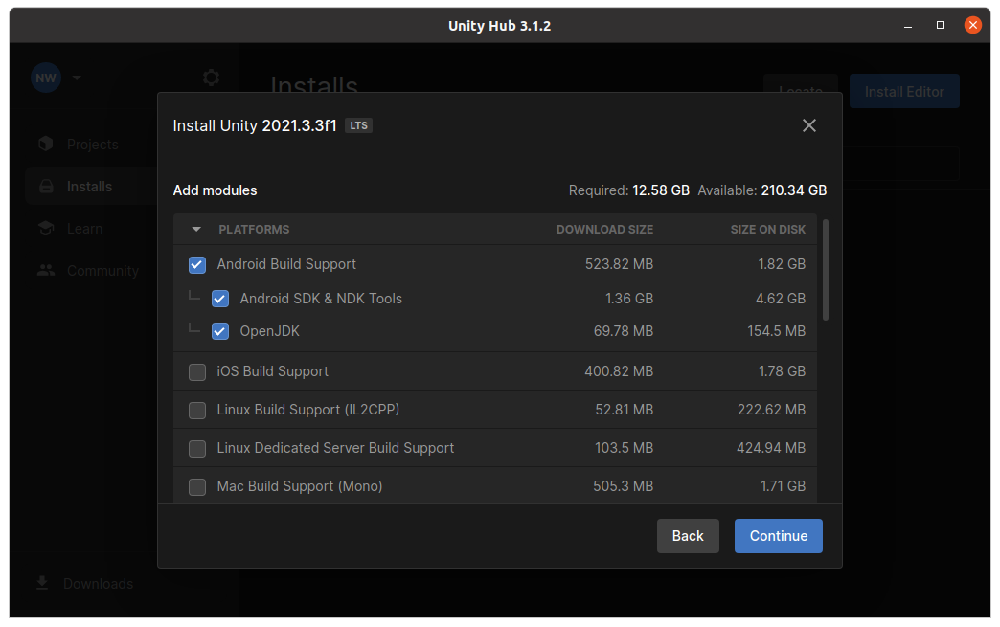
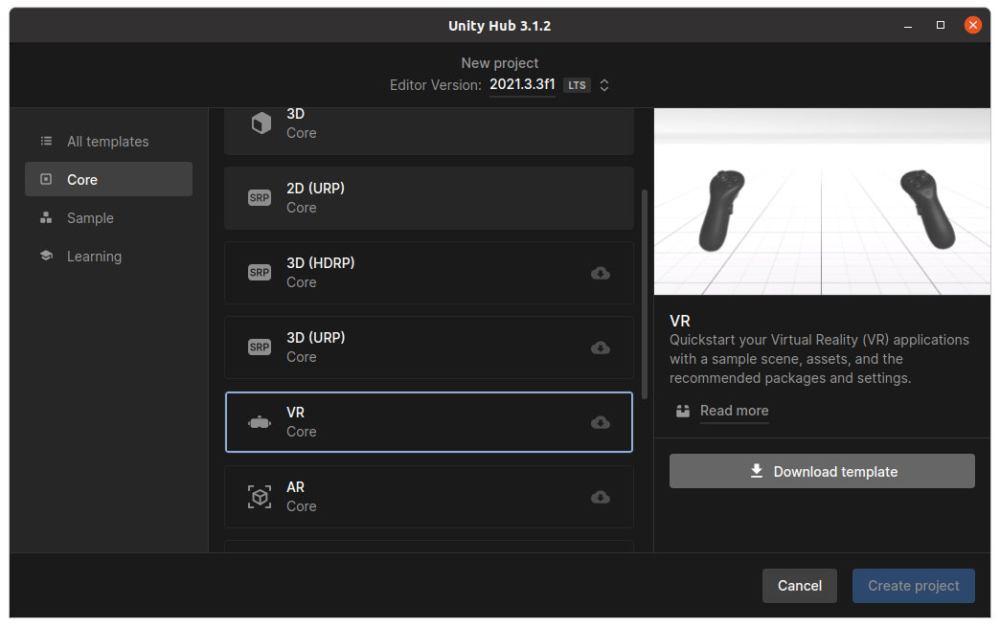
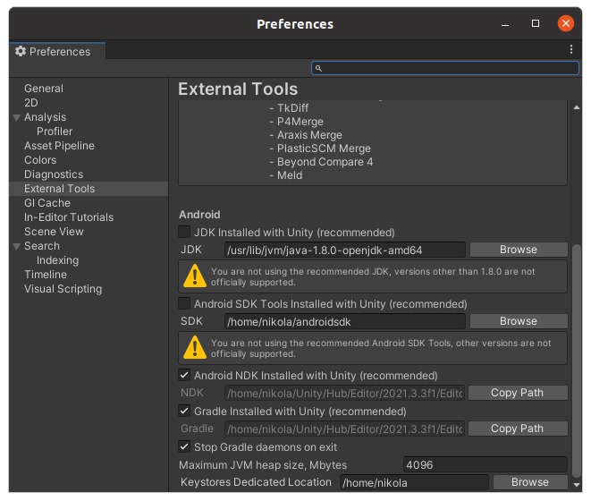
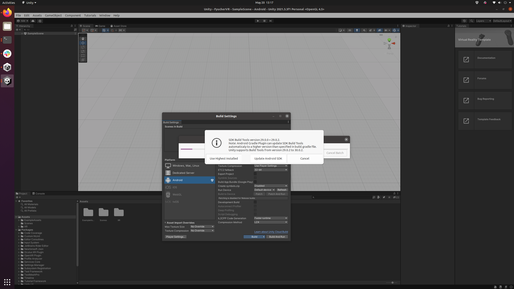

# FyucherVR

## Working With Linux (Ubuntu 20.04 LTS)

A lot of the following is based on this guide: https://devinwillis.com/2019/11/29/oculus-quest-development-with-linux-and-unity3d/

However, that guide did not work 100% out of the box for me (though it was still extremely useful),
so this README will cover everything from start to finish.

### Install Unity

Basically follow the instructions here: https://docs.unity3d.com/hub/manual/InstallHub.html#install-hub-linux

This means run:

```
sudo sh -c 'echo "deb https://hub.unity3d.com/linux/repos/deb stable main" > /etc/apt/sources.list.d/unityhub.list'
wget -qO - https://hub.unity3d.com/linux/keys/public | sudo apt-key add -
sudo apt update
sudo apt-get install unityhub
```

Then install the Unity Editor (version 2021.3.3f1) with Android support:



Note: we will not actually use the Unity-installed JDK or Android SDK, though we will use the Android NDK.

Then run:

```
chmod -R +x /home/YOURUSERNAME/Unity/Hub/Editor/2021.3.3f1/Editor/Data/PlaybackEngines/AndroidPlayer/NDK
```

Change `YOURUSERNAME` to your username. This step is required because things don't compile in Unity
because the various executables in the `NDK` directory and sub-directories are not executable...

### Install the JDK

```
sudo apt install openjdk-8-jdk
```

If you, at this point, have multiple OpenJDK versions installed, make sure to set the system's JDK version
to 8 using:

```
sudo update-alternatives --config java
```

### Install the Android SDK

```
wget https://dl.google.com/android/repository/sdk-tools-linux-4333796.zip
unzip sdk-tools-linux-4333796.zip -d ~/androidsdk
```

Then add the following line to your `~/.bashrc`:

```
export PATH=/home/YOURUSERNAME/androidsdk/tools/:/home/YOURUSERNAME/androidsdk/tools/bin:$PATH
```

Change `YOURUSERNAME` to your username. Then start a fresh terminal or run:

```
source ~/.bashrc
```

Then run:

```
sdkmanager --list
sdkmanager "build-tools;29.0.0"
sdkmanager "platform-tools"
```

### Setting Up The Project

In Unity Hub, start a new project (using Unity Editor 2021.3.3f1),
make it a "VR Core" project (you will need to download the template):



Then, in the Editor, go to:

`Edit -> Project Settings`

Click in the "XR Plug-in Management" tab on the left. In the Desktop tab,
uncheck "OpenXR" and check instead "Oculus". Then in the Android tab, check "Oculus".

Now go to:

`Edit -> Preferences`

And in the "External Tools" tab, change the JDK path to:

```
/usr/lib/jvm/java-1.8.0-openjdk-amd64
```

And change the Android SDK path to:

```
/home/YOURUSERNAME/androidsdk
```

Change `YOURUSERNAME` to your username. Things should look like this:



Finally, go to:

`File -> Build Settings`

In the "Android" tab, click "Switch Platform". Then click "Build".
You will get some (two?) warnings/notifications to upgrade the Android SDK - click "Update Android SDK" in all (both?) cases:




The APK should now be built and ready to install on a Quest 2!
