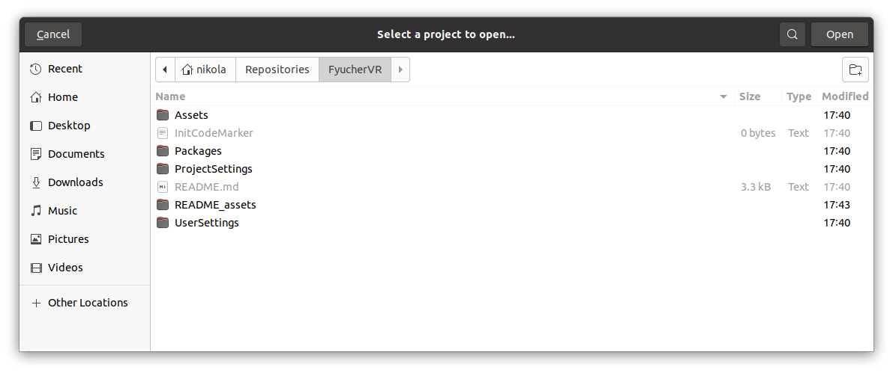
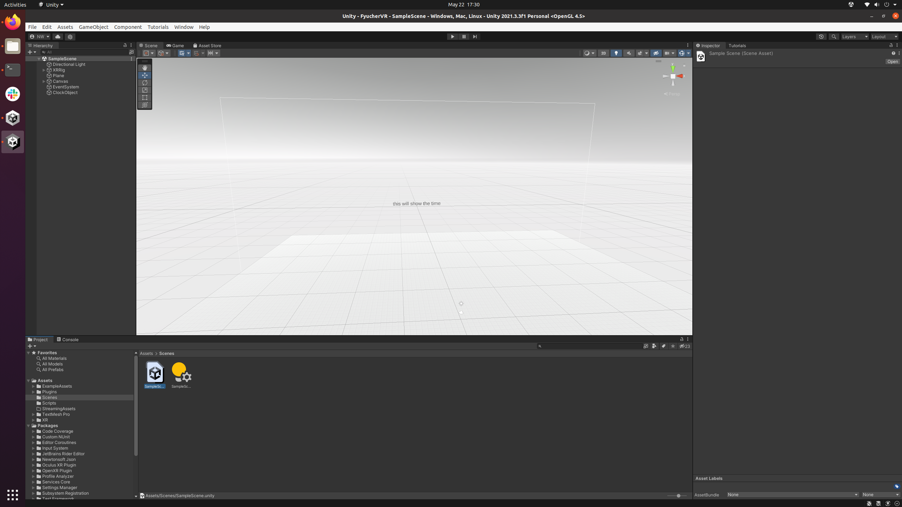
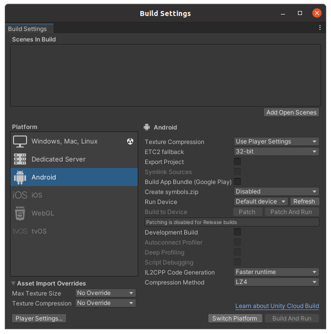
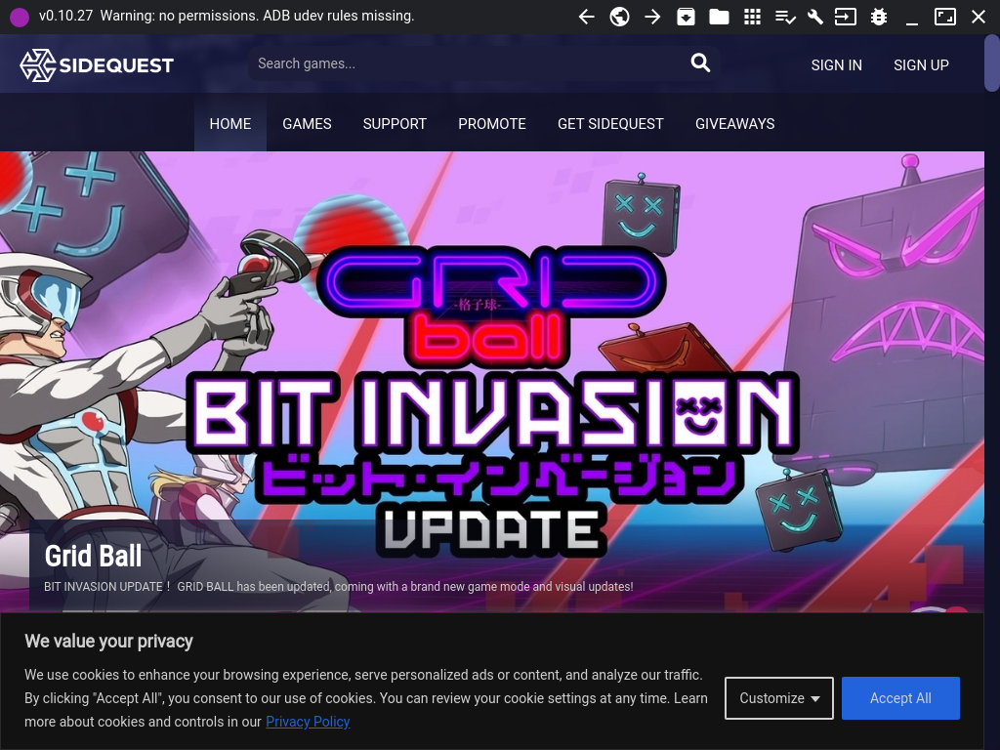
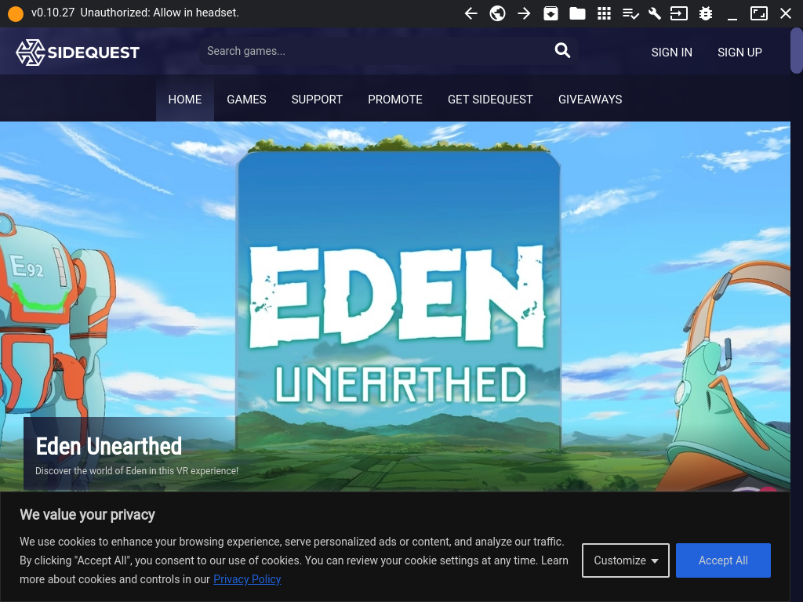
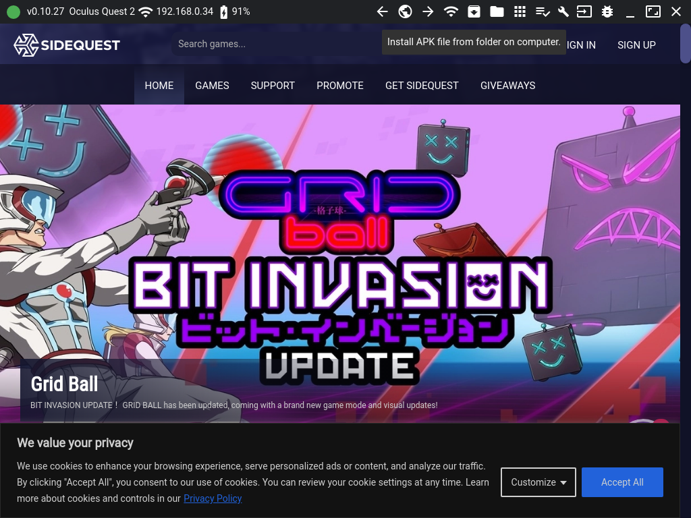
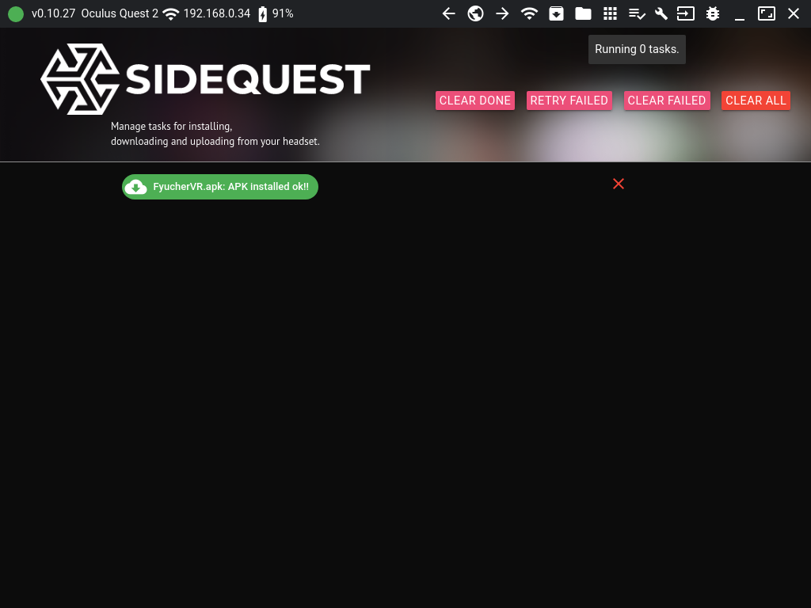

# FyucherVR

## Working With Linux (Ubuntu 20.04 LTS)

A lot of the following is based on this guide: https://devinwillis.com/2019/11/29/oculus-quest-development-with-linux-and-unity3d/

However, that guide did not work 100% out of the box for me (though it was still extremely useful),
so this README will cover everything from start to finish.

Note that the general procedure here is to build the VR App in Unity, and copy the resulting APK file to the Quest 2 for execution and testing.
This is not an ideal solution, as it is cumbersome. However, for simple projects and slow development, this will get you going!

### Install Unity

Basically follow the instructions here: https://docs.unity3d.com/hub/manual/InstallHub.html#install-hub-linux

This means run:

```
sudo sh -c 'echo "deb https://hub.unity3d.com/linux/repos/deb stable main" > /etc/apt/sources.list.d/unityhub.list'
wget -qO - https://hub.unity3d.com/linux/keys/public | sudo apt-key add -
sudo apt update
sudo apt-get install unityhub
```

Then install the Unity Editor (version 2021.3.3f1) with Android support:


Note: we will not actually use the Unity-installed JDK or Android SDK, though we will use the Android NDK.

Then run:

```
chmod -R +x /home/YOURUSERNAME/Unity/Hub/Editor/2021.3.3f1/Editor/Data/PlaybackEngines/AndroidPlayer/NDK
```

Change `YOURUSERNAME` to your username. This step is required because things don't compile in Unity
because the various executables in the `NDK` directory and sub-directories are not executable...

### Install the JDK

```
sudo apt install openjdk-8-jdk
```

If you, at this point, have multiple OpenJDK versions installed, make sure to set the system's JDK version
to 8 using:

```
sudo update-alternatives --config java
```

### Install the Android SDK

```
wget https://dl.google.com/android/repository/sdk-tools-linux-4333796.zip
unzip sdk-tools-linux-4333796.zip -d ~/androidsdk
```

Then add the following line to your `~/.bashrc`:

```
export PATH=/home/YOURUSERNAME/androidsdk/tools/:/home/YOURUSERNAME/androidsdk/tools/bin:$PATH
```

Change `YOURUSERNAME` to your username. Then start a fresh terminal or run:

```
source ~/.bashrc
```

Then run:

```
sdkmanager --list
sdkmanager "build-tools;29.0.0"
sdkmanager "platform-tools"
```

### Setting Up A VR Project From Scratch

In Unity Hub, start a new project (using Unity Editor 2021.3.3f1),
make it a "VR Core" project (you will need to download the template):


Then, in the Editor, go to:

`Edit -> Project Settings`

Click in the "XR Plug-in Management" tab on the left. In the Desktop tab,
uncheck "OpenXR" and check instead "Oculus". Then in the Android tab, check "Oculus".

Now go to:

`Edit -> Preferences`

And in the "External Tools" tab, change the JDK path to:

```
/usr/lib/jvm/java-1.8.0-openjdk-amd64
```

And change the Android SDK path to:

```
/home/YOURUSERNAME/androidsdk
```

Change `YOURUSERNAME` to your username. Things should look like this:


Finally, go to:

`File -> Build Settings`

In the "Android" tab, click "Switch Platform". Then click "Build".
You will get some (two?) warnings/notifications to upgrade the Android SDK - click "Update Android SDK" in all (both?) cases:


The APK should now be built and ready to install on a Quest 2!

### Setting Up This VR Project

I highly recommend going through "Setting Up A VR Project From Scratch" first, as I have not tested this section from a fresh Unity/JDK/Android SDK install yet.

Clone this repository:

```
git clone git@github.com:nikolawhallon/FyucherVR.git
```

Open Unity Hub, click on the "Projects" tab on the left, then click on the "Open" button. Browse to the "FyucherVR" directory and click "Open":



Open the project in the Unity Editor, go to the "Project" tab on the lower left and double click "Scenes". Then double click "Sample Scene":



Now go to `File -> Build Settings`, select the "Android" tab, and click the "Switch Platform" button:



After this, you should be able to click "Build" in this "Build Settings" window to build the APK!

### Installing the APK on the Quest 2 Using SideQuest

Download SideQuest from the following URL: https://sidequestvr.com/setup-howto

Plug your Quest 2 into your computer with a USB-C cable, and open SideQuest (on Linux/Ubuntu, the SideQuest download provides a simple executable to run, so
there are no extra installation instructions here). You will probably be greated by a warning/error about ADB udev rules:



In a terminal run `lsusb` to identify the Quest 2 device. When I ran this, I found it in the output as:

```
Bus 002 Device 002: ID 2833:0186 Oculus Quest 2
```

Edit the following file:

```
sudo nano /etc/udev/rules.d/51-android.rules
```

And give it the following contents:

```
SUBSYSTEM=="usb", ATTR{idVendor}=="2833", ATTR{idProduct}=="0186", MODE="0666", GROUP="plugdev"
```

Make sure the `idVendor` and `idProduct` numbers match what `lsusb` stated for your Quest 2 (so for me these were "2833" and "0186", respectively).

Now when you look at SideQuest, you should see the following warning:



As suggested, now put on your Quest 2 headset and you will see some prompt asking you to allow the computer access to the headset - click "Allow".

Finally, in SideQuest, you should see some green dot in the upper left corner, indicating your computer is successfully connected to the Quest 2!
Now on the top bar of SideQuest, click on the "folder icon" to "Install APK file from folder on computer.":



If this was successful, you should see it if you click on the "tasks icon" in the top bar of SideQuest:



You should now have the APK installed on your Quest 2! However, to access it, you will have to navigate to "Unknown Sources" on the Quest 2.
I will try to write up how to do this after I figure out how to take screenshots on the Quest 2. In the meantime, there are plenty of guides
on Google, and I actually found it by clicking in random menus until I figured it out!
